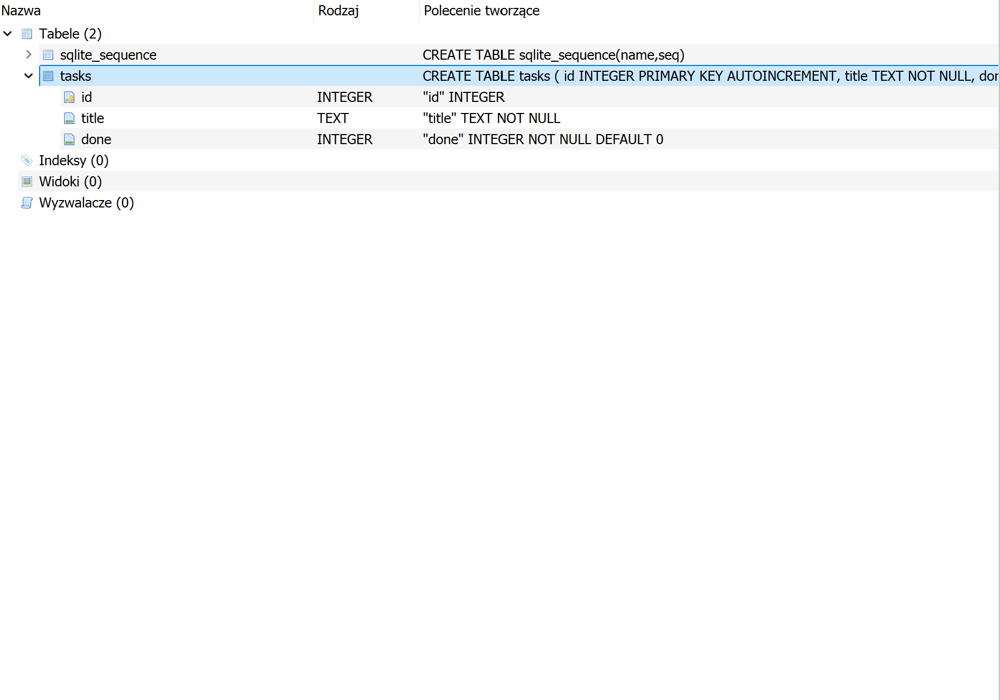

# Task API

A simple CRUD API for managing tasks, built with FastAPI and **SQLite**.

## Why SQLite?

SQLite was chosen because it is a lightweight, serverless SQL database stored in a single file. It requires no separate installation, no running server process, and no configuration. The database file (`tasks.db`) is created automatically the first time the application starts, making it ideal for learning and small projects.

## Quick start

1. **Activate the virtual environment**
   ```bash
   source venv/Scripts/activate   # Windows (Git Bash)
   # source venv/bin/activate     # Linux / macOS
   ```

2. **Install dependencies**
   ```bash
   pip install -r requirements.txt
   ```

3. **Run the server**
   ```bash
   uvicorn main:app --reload
   ```

4. **Open in browser**
   - API root: http://localhost:8000/
   - Swagger UI (interactive docs): http://localhost:8000/docs

## Database

- **File location**: `tasks.db` in the project root (created automatically on first run).
- **Table**: `tasks` with columns `id` (integer, primary key), `title` (text), `done` (boolean).
- **Seed data**: Three example tasks are inserted only when the table is empty.
- **Persistence**: Data survives server restarts.

## Endpoints

| Method | Path | Description | Status codes |
|--------|------|-------------|--------------|
| GET | `/` | API info | 200 |
| GET | `/health` | Health check | 200 |
| GET | `/tasks` | List all tasks (optional `?done=` and `?search=` filters) | 200 |
| GET | `/tasks/{id}` | Get one task | 200, 404 |
| POST | `/tasks` | Create a new task | 201, 400 |
| PUT | `/tasks/{id}` | Update a task | 200, 400, 404 |
| DELETE | `/tasks/{id}` | Delete a task | 204, 404 |
| GET | `/stats` | Task statistics | 200 |
| POST | `/reset` | Reset to the 3 default tasks | 200 |

## Example SQL query

```sql
SELECT * FROM tasks WHERE done = 1;
```

This query returns every completed task directly from the database. You can run it in any SQLite viewer (e.g., **DB Browser for SQLite**) while the server is running and see the results reflected immediately in the API.

## Example curl session

```bash
# Start the server first: uvicorn main:app --reload

# Read all tasks
curl -i http://localhost:8000/tasks
# HTTP/1.1 200 OK
# [{"id":1,"title":"Buy groceries","done":false},...]

# Create a task
curl -i -X POST http://localhost:8000/tasks \
  -H "Content-Type: application/json" \
  -d '{"title":"Buy milk"}'
# HTTP/1.1 201 Created
# {"id":4,"title":"Buy milk","done":false}

# Update it
curl -i -X PUT http://localhost:8000/tasks/4 \
  -H "Content-Type: application/json" \
  -d '{"done":true}'
# HTTP/1.1 200 OK
# {"id":4,"title":"Buy milk","done":true}

# Delete it
curl -i -X DELETE http://localhost:8000/tasks/4
# HTTP/1.1 204 No Content

# 404 example
curl -i http://localhost:8000/tasks/99
# HTTP/1.1 404 Not Found
# {"detail":"Task 99 not found"}

# Invalid body (missing title)
curl -i -X POST http://localhost:8000/tasks \
  -H "Content-Type: application/json" \
  -d '{}'
# HTTP/1.1 400 Bad Request
# {"error":"Invalid request body"}
```

## The persistence experiment

Create a few tasks, then restart the server and call `GET /tasks` again. The tasks are still there. Because data is stored in a SQLite file on disk instead of in memory, it survives server restarts. This is the core difference between Week 2 (in-memory) and Week 3 (database).

## Extras included

- **Filtering & search**: `GET /tasks?done=true` returns only finished tasks; `GET /tasks?search=milk` returns tasks whose title contains the word. Both are implemented with SQL `WHERE` clauses.
- **Stats endpoint**: `GET /stats` returns `{ "total": 7, "done": 3, "open": 4 }` using SQL `COUNT()`.
- **Reset endpoint**: `POST /reset` restores the 3 example tasks, handy for demos.

## Database viewer screenshot



> *Take a screenshot of DB Browser for SQLite showing the `tasks` table and save it as `screenshot.png` in the project root.*
