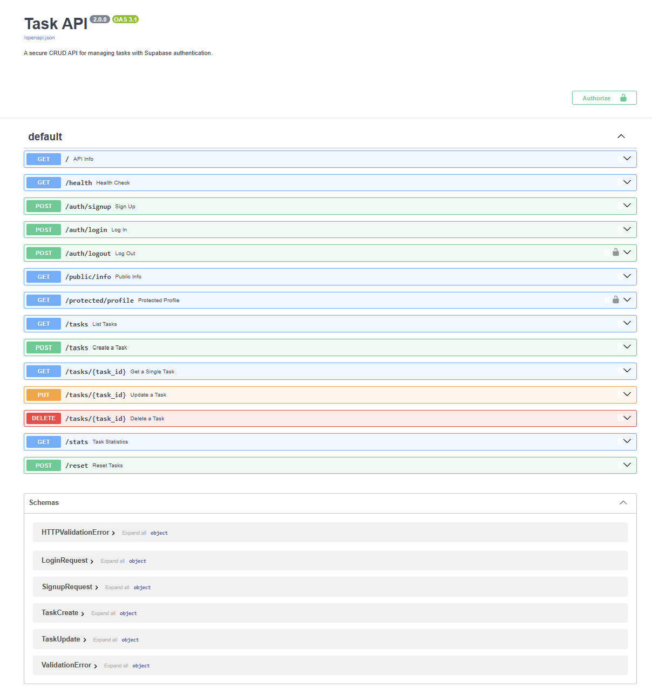

# Task API

A secure CRUD API for managing tasks, built with FastAPI, PostgreSQL (Docker), and **Supabase Authentication**.

## Why this stack?

- **PostgreSQL + Docker**: Production-grade database running locally with zero system installation. `docker compose up` starts the entire stack.
- **Supabase Auth**: Offloads user management, password hashing, and JWT issuance to a battle-tested identity provider so we don't write cryptography from scratch.
- **Layered architecture**: The API layer (`main.py`) is unchanged from Week 3. Only the auth module (`auth.py`) and route additions are new.

## Quick start

1. **Clone the repository**
   ```bash
   git clone https://github.com/PawelPikulik/Artificiall.git
   cd Artificiall
   ```

2. **Create a free Supabase project**
   - Go to [supabase.com](https://supabase.com) and create a new project.
   - In **Project Settings → API**, copy your `Project URL` and `Anon Key`.

3. **Create the environment file**
   ```bash
   cp .env.example .env
   ```
   Replace the placeholder values with your real Supabase credentials:
   ```
   SUPABASE_URL=https://your-project.supabase.co
   SUPABASE_KEY=your-anon-key
   ```
   The `.env` file is gitignored. **Never commit your Supabase keys to GitHub.**

4. **(Optional) Disable email confirmation for testing**
   In your Supabase dashboard, go to **Authentication → Settings → Email** and turn off **Confirm email**. This allows immediate login after signup in development.

5. **Start the stack**
   ```bash
   docker compose up
   ```

6. **Open in browser**
   - API root: http://localhost:8000/
   - Swagger UI (interactive docs): http://localhost:8000/docs

## Architecture

```
Client → API (main.py) → PostgreSQL repository (db.py) → PostgreSQL in Docker
                          ↓
                     Supabase Auth (auth.py) → Supabase Identity Provider
```

The task CRUD routes are identical to Week 3. The new auth layer (`auth.py`) plugs into FastAPI's dependency injection system to protect selected routes.

## Endpoints

| Method | Path | Auth | Description | Status codes |
|--------|------|------|-------------|--------------|
| GET | `/` | No | API info | 200 |
| GET | `/health` | No | Health check | 200 |
| POST | `/auth/signup` | No | Create a new user account | 201, 400 |
| POST | `/auth/login` | No | Log in, receive JWT tokens | 200, 401 |
| POST | `/auth/logout` | **Yes** | Log out (invalidate session) | 204, 401 |
| GET | `/public/info` | No | Public message | 200 |
| GET | `/protected/profile` | **Yes** | Private user profile | 200, 401 |
| GET | `/tasks` | No | List all tasks | 200 |
| GET | `/tasks/{id}` | No | Get one task | 200, 404 |
| POST | `/tasks` | No | Create a new task | 201, 400 |
| PUT | `/tasks/{id}` | No | Update a task | 200, 400, 404 |
| DELETE | `/tasks/{id}` | No | Delete a task | 204, 404 |
| GET | `/stats` | No | Task statistics | 200 |
| POST | `/tasks/{id}/analyze` | No | AI-powered task analysis | 200, 404, 503 |
| POST | `/reset` | No | Reset tasks to defaults | 200 |

## AI Task Analysis (BE-07)

The `POST /tasks/{id}/analyze` endpoint sends a task title to a large language model and returns a structured, schema-validated judgement.

**Data flow:**
```
Client → POST /tasks/1/analyze
         ↓
    FastAPI endpoint (main.py)
         ↓
    llm.analyze_task(title)
         ↓
    Groq API (free tier, no credit card)
         ↓
    Structured JSON response
         ↓
    Pydantic TaskAnalysis schema validation
         ↓
    200 OK → {task_id, title, analysis: {priority, category, estimated_minutes, reasoning}}
```

**Trust features:**
- **Schema validation:** Every field is checked by Pydantic (priority must be High/Medium/Low, estimated_minutes 0-10080, reasoning 10-500 chars)
- **Timeout:** Configurable per-request timeout (default 15s)
- **Retries:** Exponential backoff on rate limits (429), connection errors, and 5xx. Max 3 attempts. 4xx client errors are NOT retried.
- **Graceful degradation:** Returns 503 Service Unavailable with a clear message on LLM failure, so your app can decide what to do next.

**How to get a free Groq API key:**
1. Go to https://console.groq.com/keys
2. Sign up (no credit card required)
3. Create a new key and paste it into your `.env` as `GROQ_API_KEY`

**Example:**
```bash
curl -X POST http://localhost:8000/tasks/1/analyze
# Response:
# {
#   "task_id": 1,
#   "title": "Buy groceries",
#   "analysis": {
#     "priority": "Medium",
#     "category": "Errands",
#     "estimated_minutes": 45,
#     "reasoning": "Buying groceries is a routine weekly errand."
#   }
# }
```

## Authentication flow

### 1. Sign up

```bash
curl -i -X POST http://localhost:8000/auth/signup \
  -H "Content-Type: application/json" \
  -d '{"email":"you@example.com", "password":"password123"}'
# HTTP/1.1 201 Created
```

### 2. Log in

```bash
curl -i -X POST http://localhost:8000/auth/login \
  -H "Content-Type: application/json" \
  -d '{"email":"you@example.com", "password":"password123"}'
# HTTP/1.1 200 OK
# {"access_token":"eyJ...", "refresh_token":"...", "user":{...}}
```

### 3. Access a protected route

Copy the `access_token` from the login response and send it in the `Authorization` header:

```bash
curl -i http://localhost:8000/protected/profile \
  -H "Authorization: Bearer eyJ..."
# HTTP/1.1 200 OK
# {"id":"...", "email":"you@example.com", "created_at":"..."}
```

### 4. Log out

```bash
curl -i -X POST http://localhost:8000/auth/logout \
  -H "Authorization: Bearer eyJ..."
# HTTP/1.1 204 No Content
```

### Error examples

Missing token on a protected route:
```bash
curl -i http://localhost:8000/protected/profile
# HTTP/1.1 401 Unauthorized
# {"detail":"Access token required"}
```

Invalid credentials:
```bash
curl -i -X POST http://localhost:8000/auth/login \
  -H "Content-Type: application/json" \
  -d '{"email":"bad@example.com", "password":"wrong"}'
# HTTP/1.1 401 Unauthorized
# {"detail":"Invalid login credentials"}
```

## Swagger UI

Open http://localhost:8000/docs in your browser. Click the **Authorize** 🔒 button, paste your JWT `access_token`, and click **Authorize**. Now you can use **Try it out** on protected routes directly from the browser.



> *Replace this with a screenshot of Swagger UI showing the Authorize button and protected routes.*

## The persistence experiment

Create a few tasks, then run `docker compose down` followed by `docker compose up`. The tasks are still there because PostgreSQL data is stored in a named Docker volume (`postgres_data`).

## Extras included

- **Filtering & search**: `GET /tasks?done=true` returns only finished tasks; `GET /tasks?search=milk` returns tasks whose title contains the word. Both implemented with SQL `WHERE` clauses in PostgreSQL.
- **Stats endpoint**: `GET /stats` returns task counts using SQL `COUNT()`.
- **Reset endpoint**: `POST /reset` restores the 3 example tasks.
- **Auth middleware**: `auth.get_current_user` is a reusable FastAPI dependency that extracts and verifies the Bearer token on any protected route.

## The Polite Scraper (BE-05)

A standalone scraper that collects books from [books.toscrape.com](https://books.toscrape.com) and turns messy HTML into clean, schema-validated JSON.

### Why this matters
Every AI system starts with data. This scraper demonstrates the habits that separate production code from quick tutorials:

| Practice | Implementation |
|----------|----------------|
| **Check the rules first** | `urllib.robotparser` checks `robots.txt` before every page fetch |
| **Identify yourself** | Custom `User-Agent` header with project name and GitHub link |
| **Go slowly** | `time.sleep(1)` between page requests |
| **Handle failures gracefully** | Broken pages, timeouts, and parse errors are caught and logged; the scraper continues |
| **Validate every record** | Every book is parsed through a Pydantic `Book` schema |
| **Clean raw data** | Prices like `"£51.77"` are turned into `51.77` before storage |

### Run the scraper

```bash
python scraper.py
```

Output:
```
Starting polite scraper ...
User-Agent: Mozilla/5.0 (compatible; ArtificiallBot/1.0; ...)
Request delay: 1.0s

Fetching https://books.toscrape.com/index.html ...
  → 20 books parsed
Fetching https://books.toscrape.com/catalogue/page-2.html ...
  → 20 books parsed
Fetching https://books.toscrape.com/catalogue/page-3.html ...
  → 20 books parsed
Saved 60 books to books.json

Total books collected: 60
```

### Schema (`schemas.py`)

```python
class Book(BaseModel):
    title: str
    price: float        # cleaned from "£51.77" → 51.77
    availability: str
    rating: int         # 1-5, mapped from CSS classes like "star-rating Three"
    url: str
    image_url: str | None
```

### Files

- `scraper.py` — full scraping logic with polite practices
- `schemas.py` — Pydantic validation and data cleaning
- `books.json` — generated output (60 validated records)

---

## Testing

A test suite (`test_api.py`) covers all task endpoints. Run it while the stack is up:

```bash
python test_api.py
```

For auth testing, use the curl examples above or the Swagger UI.

## PDF Report Generator (BE-08)

Generate styled PDF reports from SQL-aggregated data and scraped JSON catalogs — asynchronously, in the background, with artifact storage and scheduled recurrence.

### Why this matters

"Generate a report" is the most classic background job in software. This feature exercises everything from the last four weeks in one deliverable: SQL aggregation, artifact handling (store the path, not the 20 MB blob), and the background-job pattern.

### Architecture

| Component | File | Purpose |
|-----------|------|---------|
| Database | `init.sql` | `reports` and `scheduled_reports` tables |
| CRUD | `db.py` | Report & scheduled-report persistence |
| PDF Engine | `report_generator.py` | `fpdf2`-based renderer with styled headers, tables, and text blocks |
| Job Runner | `jobs.py` | FastAPI `BackgroundTasks` integration; status `pending → running → completed/failed` |
| Scheduler | `scheduler.py` | APScheduler cron-style recurring reports |
| API | `main.py` | `/reports` endpoints (POST, GET, download, DELETE) + `/reports/schedule` (stretch) |

### Report types

| Type | Data source | Contents |
|------|-------------|----------|
| `task_summary` | PostgreSQL `tasks` table | Total/completed/open counts, completion rate, full task list |
| `book_catalog` | `books.json` (BE-05 scraper) | Catalog overview, price/rating aggregates, rating distribution histogram, top 15 books |

### Quick start

1. **Install new dependencies**
   ```bash
   pip install fpdf2 apscheduler
   ```

2. **Restart the stack** (so `init.sql` creates the new tables)
   ```bash
   docker compose down
   docker compose up --build
   ```

3. **Authenticate** (same flow as above — sign up or log in to get an `access_token`)

4. **Queue a report**
   ```bash
   curl -X POST http://localhost:8000/reports \
     -H "Authorization: Bearer $TOKEN" \
     -H "Content-Type: application/json" \
     -d '{"report_type": "task_summary"}'
   # → {"id": 1, "status": "pending", "download_url": "/reports/1/download"}
   ```

5. **Poll for completion**
   ```bash
   curl http://localhost:8000/reports/1 \
     -H "Authorization: Bearer $TOKEN"
   # → {"id": 1, "status": "completed", "file_path": "reports/task_summary_1.pdf", ...}
   ```

6. **Download the PDF**
   ```bash
   curl http://localhost:8000/reports/1/download \
     -H "Authorization: Bearer $TOKEN" \
     -o report_1.pdf
   ```

### Endpoints

| Method | Path | Auth | Description | Status codes |
|--------|------|------|-------------|--------------|
| POST | `/reports` | **Yes** | Queue a PDF report | 202, 401, 422 |
| GET | `/reports` | **Yes** | List your reports | 200, 401 |
| GET | `/reports/{id}` | **Yes** | Get report status | 200, 401, 404 |
| GET | `/reports/{id}/download` | **Yes** | Stream the PDF | 200, 401, 404, 409 |
| DELETE | `/reports/{id}` | **Yes** | Delete report + file | 204, 401, 404 |
| POST | `/reports/schedule` | **Yes** | Create recurring report | 201, 401, 422 |
| GET | `/reports/schedule` | **Yes** | List scheduled reports | 200, 401 |
| DELETE | `/reports/schedule/{id}` | **Yes** | Cancel scheduled report | 204, 401, 404 |

### Background job pattern

```
POST /reports
  → DB insert (status = pending)
  → BackgroundTasks.add_task(run_report_job)
  → 202 Accepted to client immediately

Background worker:
  → DB update (status = running)
  → Query data + generate PDF → save to disk
  → DB update (status = completed, file_path = ...)
  → On error: DB update (status = failed, error_message = ...)
```

### Artifact handling

- PDFs are stored in the `reports/` directory (Docker volume `reports_data`)
- The database stores only the **file path** — never the binary content
- On delete, both the DB row and the file are removed

### Scheduled reports (stretch)

```bash
# Schedule a weekly task summary every Monday at 9:00 AM
curl -X POST http://localhost:8000/reports/schedule \
  -H "Authorization: Bearer $TOKEN" \
  -H "Content-Type: application/json" \
  -d '{"report_type": "task_summary", "cron": "0 9 * * 1"}'

# List scheduled jobs
curl http://localhost:8000/reports/schedule \
  -H "Authorization: Bearer $TOKEN"

# Cancel a scheduled job
curl -X DELETE http://localhost:8000/reports/schedule/1 \
  -H "Authorization: Bearer $TOKEN"
```

### Testing

Run the report test suite while the stack is up:

```bash
python test_reports.py
```

This signs up a test user, queues both report types, polls until completion, downloads a PDF, validates the magic bytes (`%PDF`), and cleans up.
